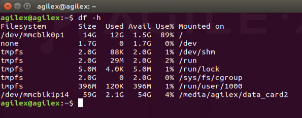
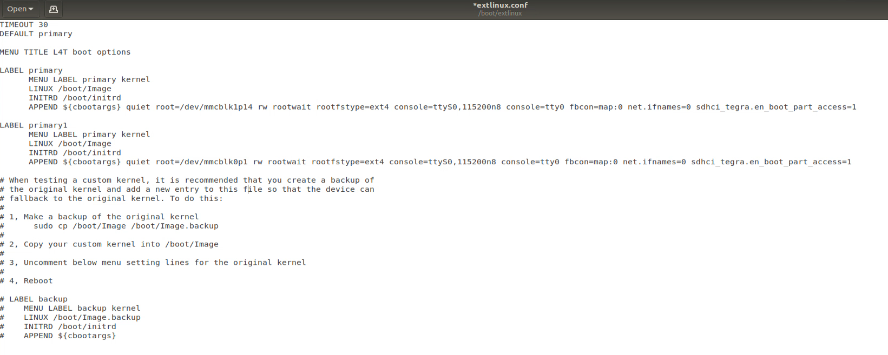
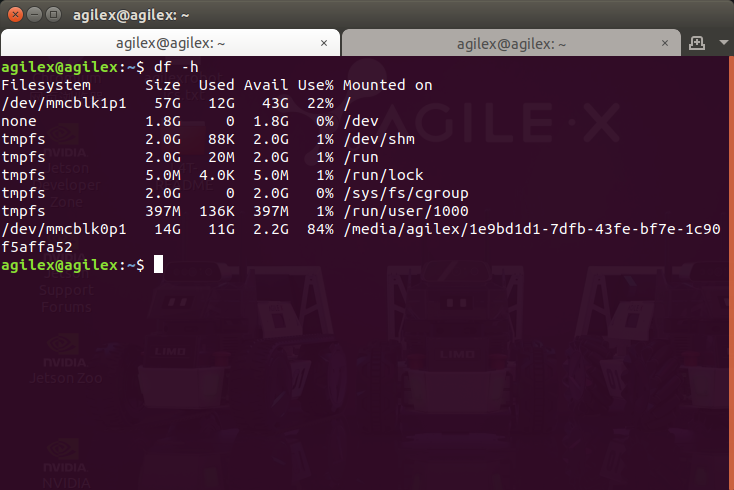
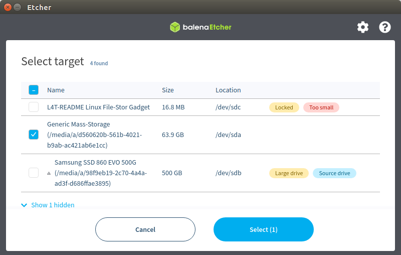

# LIMO_emmc2sd 说明书

本文介绍 jetson 平台在 jetpack4.6 下，如何从 SD卡启动系统和刷机的方法

软件平台：jetpack4.6(刷机用的镜像版本)

硬件环境：装配 ubuntu18.04 的电脑，nano 核心板+载板

### 一、从SD卡启动系统

#### 1、插入一张格式化过的SD卡

打开终端，在终端中输入命令：

```
df -h
```

成功挂载SD卡之后，在终端中显示，如图：



#### 2、对系统进行拷贝

（1）下载脚本jetsonhacks/bootFormUSB

打开终端，在终端中输入：

```
git clone https://github.com/jetsonhacks/bootFromUSB
```

（2）进入 bootFromUSB 目录执行操作

在终端中输入命令：

```
cd bootFromUSB
```

执行脚本：

```
./copyRooToUSB.sh -p /dev/mvmeon1p1/
```

注意：如果提示脚本没有执行权限，需要在终端输入命令赋予脚本权限：

```
chmod +x copyRootToUSB.sh 
```

#### 3、修改启动顺序

在终端中输入命令：

```
cd /boot/extlinux/
```

备份一下当前的配置

```
sudo cp extlinux.conf bak_extlinux.conf
```

修改extlinux.conf

```
sudo gedit extlinux.conf
```

修改后的extlinux.conf，如图：



修改内容：

将/dev/mmcblk0p1，改为/dev/mmcblk1p14（从/dev/mmcblk1p14启动系统）

将primary，改为primary1（避免从emmc启动系统）

保存文件，重启系统之后，打开终端，在终端中输入命令：

```
df -h
```



### 二、使用我司的镜像，从SD卡启动系统

### 1、烧录镜像

##### 1.1 下载安装balenaetcher

在个人PC电脑上下载安装balenaetcher，下载链接：https://www.balena.io/etcher/，根据个人电脑的操作系统和架构下载不同的版本。

##### 1.2 下载需要烧录的镜像

使用百度云盘下载镜像，下载链接为： 链接: 链接: https://pan.baidu.com/s/1zKmnETl2sWcZcaPOfYWtWQ 提取码: gkos 

##### 1.3 软件使用说明

软件使用说明以在Linux系统下为例子。

（1）打开软件，选择需要烧录的镜像


（2）选择需要进行烧录的SD卡



（3）点击Flash，开始烧录


#### 2、修改启动顺序

插入SD卡，并查看SD卡是否正确挂载，打开终端，在终端中输入：

```
df -h
```


在终端中输入命令：

```
cd /boot/extlinux/
```

备份一下当前的配置

```
sudo cp extlinux.conf bak_extlinux.conf
```

修改extlinux.conf

```
sudo gedit extlinux.conf
```

修改后的extlinux.conf，如图：


保存文件，重启系统之后，打开终端，在终端中输入命令：

```
df -h
```


