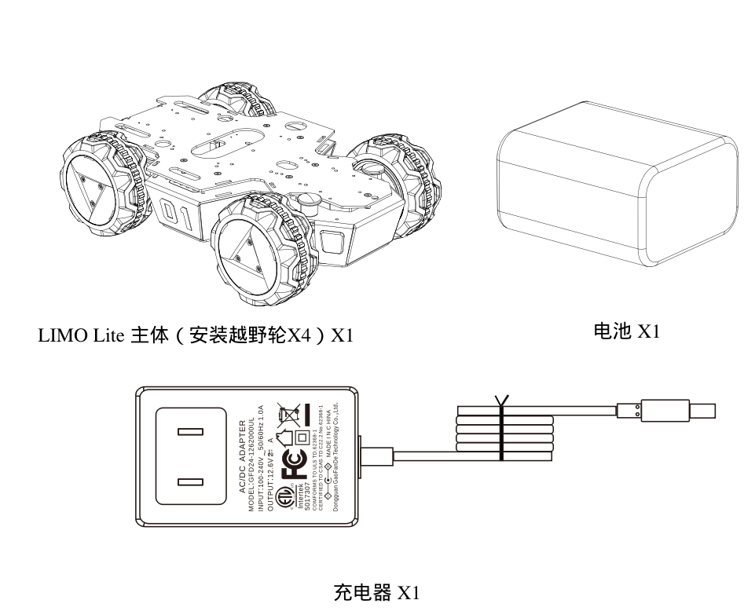
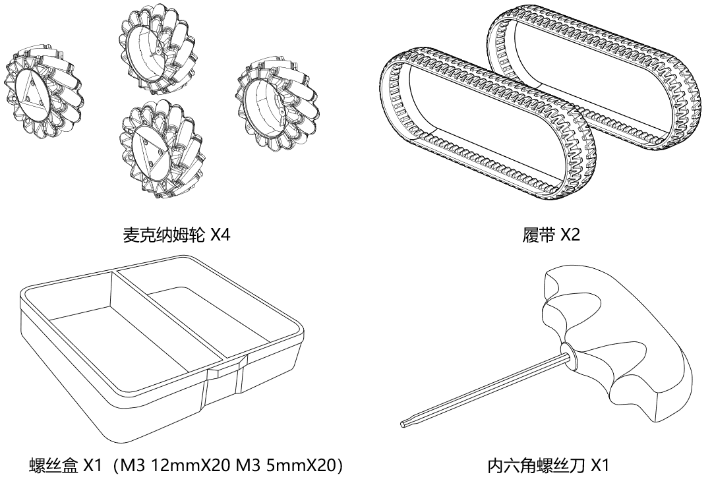
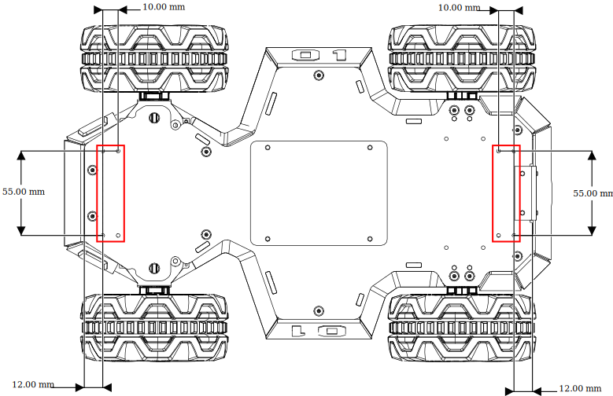
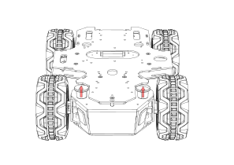
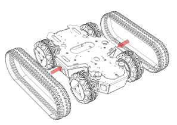
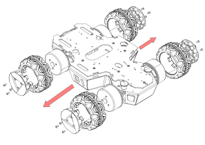
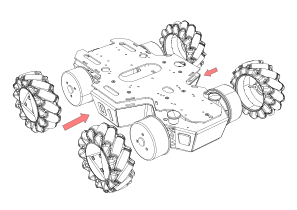
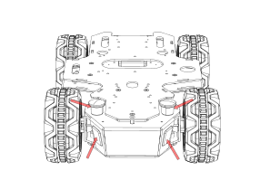
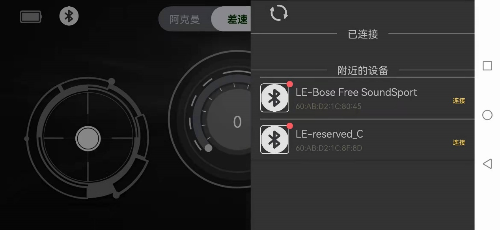

# Limo liter 使用说明

## 一、LIMO Lite简介

### 1.1 产品简介

松灵机器人LIMO Lite是LIMO的纯底盘版本，通过创新性的机械设计，能实现四轮差速、阿克曼、履带型、麦克纳姆轮运动模式的快速切换，拓展板预留丰富的安装孔位，用户可根据自己的需求加装不同的传感器。 

### 1.2 产品列表

| 名称                          | 数量                 |
| ----------------------------- | -------------------- |
| LIMO Lite主体（安装越野轮X4） | X1                   |
| 电池                          | X1                   |
| 充电器                        | X1                   |
| 麦克纳姆轮                    | X4                   |
| 履带                          | x2                   |
| APP_Nexus                     | X1                   |
| 内六角螺丝刀                  | X1                   |
| 螺丝                          | M3*12mmx3、M3*5mmx20 |

 

 

### 1.3 性能参数

<table>
	<tr>
		<td>参数类型</td>
		<td>项目</td>
        <td>指标</td>
	</tr>
	<tr>
		<td rowspan="8">机械参数</td>
		<td>外形尺寸</td>
        <td>317*220*96mm</td>
	</tr>
	<tr>
		<td>轴距</td>
        <td>200mm</td>
	</tr>
    	<tr>
		<td>轮距</td>
        <td>175mm</td>
	</tr>
    	<tr>
		<td>自重</td>
        <td>？</td>
	</tr>
    	<tr>
		<td rowspan="3">负载</td>
            <td>四轮差速（？）</td>
            <tr>
				<td>阿克曼模式（？）</td>
			</tr>
        	<tr>
                <td>麦轮模式（？）</td>
    		</tr>
	</tr>
    	<tr>
		<td>最小离地间隙</td>
            <td>24mm</td>
	</tr>
    	<tr>
		<td>驱动方式</td>
            <td>轮毂电机(4x14.4W)</td>
	</tr>
<tr>
		<td rowspan="4">性能参数</td>
		<td>空载最高车速</td>
        <td>1m/s</td>
	</tr>
<tr>
		<td>阿克曼最小转弯半径</td>
        <td>0.4m</td>
	</tr>
<tr>
		<td>工作环境</td>
        <td>-10~+40℃</td>
	</tr>
<tr>
		<td>最大爬坡角度</td>
        <td>40°（履带模式下）</td>
	</tr>
	<td rowspan="11">系统参数</td>
		<td>电源接口</td>
        <td>DC（5.5x2.1mm)</td>
	</tr>
	<tr>
		<td>系统</td>
        <td>Ubuntu18.0</td>
	</tr>
    	<tr>
		<td>IMU</td>
        <td>MPU6050</td>
	</tr>
    	<tr>
		<td>CPU</td>
        <td>ARM 64位四核@1.43GHz （Cortex-A57）</td>
	</tr>
    	<tr>
	</tr>
    	<tr>
		<td>GPU</td>
        <td>128核 NVIDIA Maxwell @921MHz</td>
	</tr>
    	<tr>
		<td>电池</td>
            <td>5200mAh 12V</td>
	</tr>
    	<tr>
		<td>工作时间</td>
            <td>1h</td>
	</tr>
    	<tr>
		<td>待机时间</td>
            <td>2h</td>
	</tr>
    	<tr>
		<td>通讯接口</td>
            <td>WIFI、蓝牙</td>
	</tr>
    	<tr>
		<td>预留接口</td>
            <td>Type-C X1；12v X1；5V X1</td>
	</tr>
	<td rowspan="2">控制参数</td>
		<td>控制模式</td>
        <td>手机APP、指令控制</td>
	</tr>
	<tr>
		<td>手机APP</td>
        <td>蓝牙/极限距离10m</td>
	</tr>
</table> 

### 1.4 部件名称

①　安装拓展板；

②　电量表；

③　四轮差速/阿克曼模式切换插销；

④　轮毂电机;

⑤　RGB车灯；

 

⑥　开关；

⑦　预留接口；

⑧　电池门；

 

### 1.5 功能亮点

（1）使用四个轮毂电机，节省车体内部空间，可在一个车体上实现阿克曼、四轮差速、履带和麦轮这四种模态的快速切换；

①阿克曼模式：

一种为了解决交通工具转弯时，内外转向轮路径指向的圆心不同的几何学，依据阿克曼转向几何设计的车辆，沿着弯道转弯时，利用四连杆的相等曲柄使内侧轮的转向角比外侧轮大大约2~4度，使四个轮子路径的圆心大致上交会于后轴的延长线上瞬时转向中心，让车辆可以顺畅的转弯。

 

②四轮差速模式：

四轮驱动，可实现原地自转，但对轮胎磨损严重，请勿长时间原地自转；

 

③履带模式：

具有良好的越野性能，可上40°坡和小台阶；

④麦克纳姆轮模式：

基于麦克纳姆轮技术的全方位运动设备可以实现前行、横移、斜行、旋转及其组合等运动方式。

 

（2）车灯状态指示：

两车灯为RGB LED，选用5种对比度高的颜色作为指示灯，其余颜色可供开发者自定义；

| ***\*颜色\**** | ***\*状态\****    |
| -------------- | ----------------- |
| 红色闪烁       | 低电量/主控报警   |
| 红色常亮       | 程序暂停          |
| 绿色           | 阿克曼模式        |
| 黄色           | 四轮差速/履带模式 |
| 蓝色           | 麦克纳姆轮模式    |

 

（3）电池可拆换；

（5）预留丰富的拓展孔位：

拓展板可供用户自己拓展不同的传感器，预留多种孔位，可适配以下几种传感器：

相机：D435，ZED 

开发板：Xavier，Nano，树莓派，英特尔NUC

机械臂：open manipulator

激光雷达：EAI X2L，思岚A2，思岚A1

 

车底前后各预留四个M3螺丝孔位；

6.模态切换方法

（1)切换阿克曼模式：

先将两侧插销拔起，顺时针转30度，使两插销上较长的线指向车体正前方即可卡住，车灯变为绿色则切换成功；

 

 

（2)切换四轮差速模式：

  拔起来顺时针转30度，使两插销上较短的线指向车体正前方，此时为插入状态，微调轮胎角度对准孔位让插销插入，车灯变为黄色则切换成功；

 

 

（3）切换履带模式：

在四轮差速模式下将履带直接套上即可；

（4）切换麦轮模式：

先将轮毂盖和轮胎拆下，只保留轮毂电机，保证每个麦轮的小滚子朝向车体中心，用包装里的M3*5螺丝将麦轮安装上，最后需要用遥控/APP调整至麦轮模式。

 

***\*注意：确保每个麦轮安装角度！\****

 

 

7.操作说明

（1）长按开关键开机（短按暂停程序），观察电量表，最后一颗红灯量时请及时充电或更换电池；

（2）观察前面插销状态以及车灯颜色判断当前模式：

| ***\*插销状态\**** | ***\*车灯颜色\**** | ***\*当前模式\**** |
| ------------------ | ------------------ | ------------------ |
| 插入               | 黄色               | 四轮差速/履带模式  |
| 蓝色               | 麦克纳姆轮模式     |                    |
| 拔起               | 绿色               | 阿克曼模式         |

（4）APP遥控说明

1、 首先在手机上下载我司提供的APP--Nexus，下载方式如下：

IOS端下载：在AppStore搜索Nexus并下载

Android端扫描下面二维码：

 

下载链接：https://www.pgyer.com/CjOI

2、下载App成功后，打开App,如图1-1所示，连接LIMO_xxxxxx的蓝牙；安卓手机点击左上的的蓝牙图标进入蓝牙扫描界面  

 

3、遥控limo

左边控制杆：控制limo前进后退

右边控制杆：控制limo左转右转

中间进度条：速度值显示

模式切换：总共有三种模式，阿克曼运动模式：ackermann，四轮差速运动模式：4wd，麦克纳姆运动模式：mailun

 ackerMann：需要手动将LIMO小车切换阿克曼模式，主要用于校准零点、控制前进后退以及转动角度；

4wd：需要手动将LIMO小车切换四轮差速模式，主要控制前进后退、转换方向以及原地旋转；

Mailun：需要手动将LIMO小车切换麦轮模式，主要控制前进后退、转换方向以及原地旋转

4、APP设置说明

Language switch：通过点击右边的按钮 English/简体，来切换英语和中文

Left-romte min speed：设置LIMO小车的最小速度

Left-romte max speed：设置LIMO小车的最大速度

right-romte min speed：设置LIMO小车的最小旋转速度

right-romte max speed：设置LIMO小车的最大旋转速度

veer calibration：设置零点矫正，先点击+号，然后点击确定Verify，当校准成功会弹出提醒框Successful calibration

BlueTooth：点击弹出蓝牙扫描界面

Bluetooth management：点击random 生成任意以LIMO_xxxx的命名的名字，确认OK并同步修改小车蓝牙的名字，注意此时蓝牙会断开，并会提醒重新连接蓝牙，重新连接蓝牙后可以继续控制小车；当app再次启动，小车的蓝牙名字已经显示修改成功的状态

 

8.三视尺寸图

