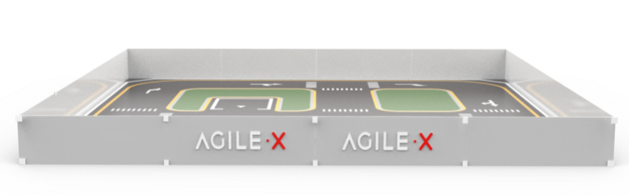
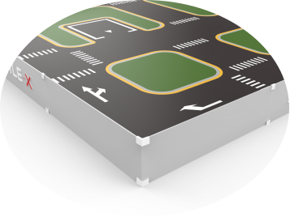

# Limo沙盘快速安装指南

## 一、Limo沙盘简介

### 1.1 产品简介

Limo沙盘是配套Limo小车使用的交互沙盘。可在沙盘上实现Limo小车的精确⾃主定位、SLAM建图、路线规划和⾃主避障、⾃主倒⻋⼊库、红绿灯识别、字符识别等功能。

### 1.2 产品列表

| 名称            | 规格                                         | 数量 |
| --------------- | -------------------------------------------- | ---- |
| 沙盘底板        | 750 *750 *5mm                                | 16   |
| 沙盘围板        | 750 *200 *5mm                                | 16   |
| 沙盘卡扣        | L型10个，U型30个                             | 40   |
| 模型树          | 15cm模型树带底座                             | 30   |
| 红绿灯          | 自动变灯手动变灯双模式红绿灯                 | 1    |
| 上坡            | 拼装上坡                                     | 1    |
| 小白板+识别字符 | 小白板+ EVA磁贴识别字符大小写字母，数字各1组 | 1    |
| 地点识别字符    | 亚克力ABCD字符                               | 1    |
| 升降杆          | 二维码识别通信                               | 1    |

**注：需要把信号收发器插到Limo的USB接口上，才能控制升降杆。**

指示灯状态指示

| 颜色 | 状态       |
| ---- | ---------- |
| 红灯 | 未连接     |
| 绿灯 | 正常连接   |
| 蓝灯 | 低电压闪烁 |

## 二、Limo沙盘搭建步骤

### 2.1 搭建底板

按照底板贴纸顺序并参考底面图拼接好底板，编号帖纸统一在底板背面右上角。

完成图：

### 2.2 搭建周边

将围板围在沙盘四周，并用L型卡扣和U型卡扣固定围边。每条边中间两块挡板带图案，其余两块不带图案。

完成图：

### 2.3 安装地点识别字符、小白板、红绿灯、上坡

将ABCD字符贴在道路尽头，用于小车识别定位地点，定点导航。

放置识字板，用于视觉图像识别。

放置红绿灯，用于红绿灯检测。

完成图：

### 2.4 放置模型数

 完成图：

### 2.5 完成搭建

备注：  

如地面与沙盘底面摩擦力小导致limo跑动引起板面位移时，可用配件里的胶布从底面将底板粘合防止位移。